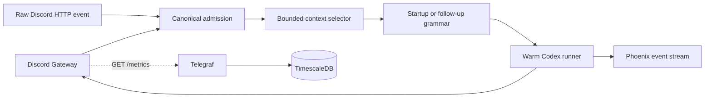

# Wiseman V2 Design

## Executable shape



`src/app/main.py` is deliberately the small coordinator. `Gateway.on_message`
and `/v1/discord/events` both pass through `normalize_event`; the replay route
accepts captured Discord JSON with nested authors, mentions, references, and
attachments as well as canonical events. A raw HTTP fixture therefore
exercises the same context, grammar, runner, delivery, and reaction path as a
Discord mention. `/v1/replay/discord` is an authenticated alias for that test
seam. `/v1/phoenix/events` exposes the in-process evidence buffer; when
`PHOENIX_OTLP_ENDPOINT` is set, each event is forwarded immediately.
The checked-in `contracts/startup-context.json` and
`contracts/followup-context.json` files are the local grammar sources; Phoenix
Prompt Hub overrides them by versioned name when configured.
Soul and runtime prompt components use the same Prompt Hub boundary, with local
environment fallbacks; memories remain workspace data.

## Turn semantics

The first event for a thread is `startup`: it selects at most 100 parent
messages. A follow-up selects only unseen parent and managed-thread messages,
plus the trigger and up to 12 reply ancestors. IDs are deduplicated before the
grammar runs. The per-thread state retains the Codex thread ID and seen IDs.

The turn order is:

```text
processing reaction -> context -> grammar -> workspace progress -> Codex -> delivery -> terminal reaction
```

The live Discord adapter creates a thread for a parent-channel mention,
collects bounded history, emits a startup banner, sends progress messages, and
then sends the answer. It adds `👀` once and then `✅` or `❌`; it never removes
`👀` and does not duplicate terminal reactions.

## Workspace

The runner creates `/workspaces/users/<user>/shared` and
`/workspaces/users/<user>/threads/<thread>`, with `AGENTS.md`, `memories.md`,
`skills/`, `.codex/`, and a validated `shared` symlink. Codex runs with the
thread directory as `HOME`, `CODEX_HOME`, and working directory. In the trusted
container, managed mode creates a deterministic private Unix user/group per
Discord user and launches that user's Codex process through
`sandbox/codex-as-user`; local tests leave managed mode disabled. The runner
uses the installed Codex SDK with full-access execution and an authenticated
HTTP boundary; Discord and platform credentials stay in the coordinator.

## Deliberate boundary

Phoenix is the semantic evidence system. Midgard's existing Telegraf path is
the operational metrics system; this service must not write TimescaleDB
directly. Temporal is an external deployment dependency. When configured, the
service runs one `wiseman.thread` workflow per Discord thread, signals new
events into that workflow, and stores the Codex thread ID and context cursor in
workflow state. The activity invokes the same canonical handler used by raw
replay. Without Temporal, the handler remains usable for local replay and
serializes turns with an in-process lock.
