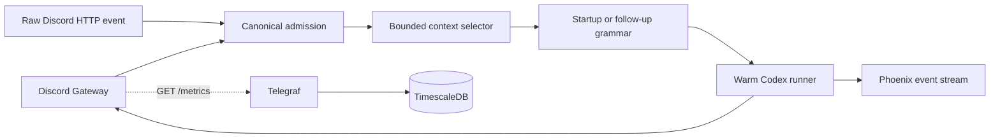

# Wiseman V2 Design

## Executable shape



`src/app/http_api.py` is deliberately the small coordinator. `Gateway.on_message`
and `/v1/discord/events` both pass through `normalize_event`; the replay route
accepts captured Discord JSON with nested authors, mentions, references, and
attachments as well as canonical events. A raw HTTP fixture therefore
exercises the same admission path as a Discord mention. `/v1/replay/discord`
is an authenticated alias for that test path. `/v1/replay/phoenix/<audit-id>`
replays the exact captured gateway envelope; when `PHOENIX_OTLP_ENDPOINT` is
set, each event is forwarded immediately.
The checked-in `contracts/startup-context.json` and
`contracts/followup-context.json` files are the local grammar sources; Phoenix
Prompt Hub overrides them by versioned name when configured.
Soul and runtime prompt components use the same Prompt Hub boundary, with local
environment fallbacks; memories remain workspace data.

The primary route is text-only DeepSeek V4 Flash. The sandbox provides a
`wiseman-discord describe-image` Codex command: the agent can pass an attachment URL to get a
generic description, or add `--question` to ask about the image. The command
calls the authenticated gateway tool endpoint, which sends the image to the
configured `WISEMAN_VISION_MODEL` (`z-ai/glm-5.3-flash`) through OpenRouter's
multimodal Chat Completions endpoint. The result is returned to Codex only when
requested, and the `vision_tool` event records the model, attachment ID,
question, usage, cost, and description.

The sandbox also provides `wiseman-discord`. `send-file` uploads a file or
image from the current thread workspace into the managed Discord thread;
`set-reactions` changes the processing, success, and failure symbols for
future turns; and `set-profile` changes the bot username and/or avatar when
profile edits are enabled. These commands call authenticated gateway tools.
Uploads are limited to the current thread or its owner-shared directory and
8 MiB; the gateway never accepts a host path or a Discord credential from the
sandbox. Reaction configuration is persisted on the gateway state volume.
The trusted sandbox intentionally does not bake in a compiler or project
toolchain: managed accounts have passwordless sudo, a usable shell, outbound
package access, and a writable root filesystem, so Codex can install the
dependencies required by the current project itself.
Each managed account keeps its private primary group for workspace ownership
and is also placed in the container-local `wsm_sudo` group; that group is the
only sudo policy entry, and it is intentionally unrestricted because this is a
trusted shared runner rather than a hostile-user boundary.

## Turn semantics

The first event for a thread is `startup`: it selects at most 100 parent
messages. A follow-up selects only unseen parent and managed-thread messages,
plus the trigger and up to 12 reply ancestors. IDs are deduplicated before the
grammar runs. The per-thread state retains the Codex thread ID and seen IDs.

The turn order is:

```text
processing reaction -> context -> grammar -> workspace progress -> Codex -> delivery -> terminal reaction
```

The live Discord adapter creates a thread for a parent-channel mention,
collects bounded history, emits one green startup embed, and edits one compact
working message into the answer for each turn. While Codex runs, the gateway
edits that message for meaningful SDK phases such as command execution, file
changes, tool calls, and response writing. Startup-only provisioning and
Codex-start status is never repeated on follow-ups. It adds `👀` once and then
`✅` or `❌`; it removes the processing `👀` after adding the terminal reaction and does not duplicate terminal reactions. The deployment allowlist is
guild-based and is enforced for both parent channels and managed threads;
messages from DMs or other guilds are ignored before context collection. The
trigger message remains the reaction target; all banner, progress, failure,
and answer messages are delivered inside the managed thread.
New threads use a sanitized, bounded preview of the triggering user message as
their name, with `Wiseman thread` as the empty-message fallback.
The gateway sets Discord's one-hour auto-archive setting on new and discovered
managed threads. Discord owns that archive boundary; Temporal owns the
three-day workspace retirement boundary, and cleanup failures remain retryable.

## Workspace

The runner creates `/workspaces/users/<user>/shared` and
`/workspaces/users/<user>/threads/<thread>`, with `AGENTS.md`, `memories.md`,
`skills/`, `.codex/`, and a validated `shared` symlink. Codex runs with the
thread directory as `HOME`, `CODEX_HOME`, and working directory. In the trusted
container, managed mode creates a deterministic private Unix user/group per
Discord user and launches that user's Codex process through
`sandbox/codex-as-user`; local tests leave managed mode disabled. The runner
uses the installed Codex SDK with full-access execution and an authenticated
HTTP boundary; Discord and platform credentials stay in the coordinator.

## Deliberate boundary

Phoenix is the semantic evidence system. Midgard's existing Telegraf path is
the operational metrics system; this service must not write TimescaleDB
directly. Temporal is an external deployment dependency. When configured, the
service runs one `wiseman.thread` workflow per Discord thread, signals new
events into that workflow, and stores the Codex thread ID and context cursor in
workflow state. The activity invokes the same canonical handler used by raw
replay. Without Temporal, the handler remains usable for local replay and
serializes turns with an in-process lock.
