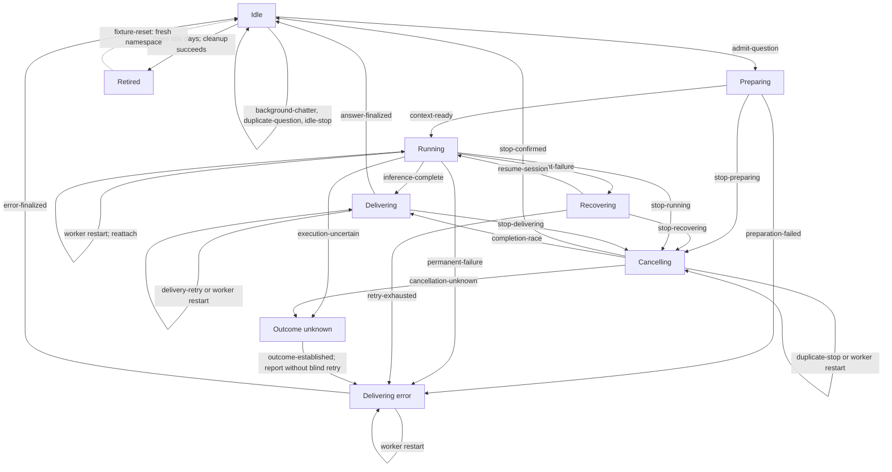

# Wiseman V2 Graph Model

GraphWalker owns traversal. The Python model in `tests/graphwalker/model.py`
supplies the native GraphWalker document and owns all graph definitions:
vertices, edge names, edge topology, edge records, timeouts, and graph state.
`vertices.py` supplies observable state conditions, `edges.py` supplies one
action function for every graph edge, and `graph_utils.py` owns only harness
contracts and transition glue. Every action and condition receives one
`GraphContext`, whose `GraphState` contains separate `chat` and `wiseman`
sub-state and whose `ClientContainer` exposes the real Temporal and Phoenix
boundaries. The HTTP harness executes those
actions through `/v1/replay/discord`; it does not call `Engine` or mutate
Temporal state directly.

`GraphContext` keeps the mutable current `GraphState` and a deep-copied
`previous_state`. The latter is captured before every edge action. Edges only
execute the boundary action and apply the deterministic transition; vertices
validate current invariants and compare both snapshots to prove additions,
consumption, queue changes, turn settlement, and retained history.

## Model data and invariants

- `pending_questions` is ordered and deduplicated by Discord message ID.
- `chat.messages` preserves the ordered incoming message history, including
  questions, background chatter, steering replies, and stop commands.
- `wiseman` owns the active question, queue, Codex session, and turn count;
  `chat` owns message and context history instead of duplicating it in the
  lifecycle state.
- `background_context` records ordinary thread discussion without advancing
  the consumed-context cursor. `context-ready` consumes it for the next
  admitted question, which covers Q1, background discussion, Q2, and Q3.
- `active_question` remains in `pending_questions` until a terminal answer,
  stopped answer, or error is finalized.
- Steering IDs and stop command IDs are tracked independently. A duplicate or
  delayed stop cannot target a later active question.
- `outcome-unknown` has no retry edge: the harness must establish the runner
  receipt before the model can report an error and continue.
- Retiring requires an idle conversation with no active or queued work.
- Verification failures are appended to `GraphState.failures` with their step,
  category, location, expected value, observed value, and message ID before
  the current walk stops. Independent seeded walks still run after cleanup.

Each vertex condition asks the harness for a `RuntimeObservation` and checks
the observed Wiseman phase, active and queued questions, session and turn
continuity, chat message order, background/consumed context, steering and
stop IDs, terminal result cardinality, progress-preview cardinality, and
retirement archival. The current replay harness supplies a deterministic
observation from the model so this contract is exercised through the HTTP
boundary; a live Temporal/Discord harness can replace that observation
provider without changing the graph conditions. Running additionally requires
Discord's typing signal to be observable. Active states must retain the
current turn number; running must have one repeatedly updated progress message,
and delivery must replace that buildup with one edited answer message.
