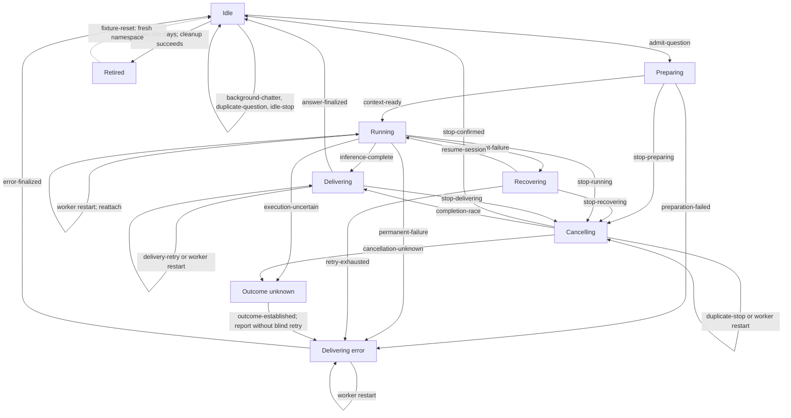

# Wiseman V2 Graph Model

GraphWalker owns traversal. The Python model in `tests/graphwalker/model.py`
supplies the native GraphWalker document and owns all graph definitions:
vertices, edge names, edge topology, edge records, and timeouts. `vertices.py`
supplies observable state conditions, `edges.py` supplies one action function
for every graph edge, and `graph_utils.py` owns runtime model state and harness
contracts. The HTTP harness executes those
actions through `/v1/replay/discord`; it does not call `Engine` or mutate
Temporal state directly.

## Model data and invariants

- `pending_questions` is ordered and deduplicated by Discord message ID.
- `background_context` records ordinary thread discussion without advancing
  the consumed-context cursor. `context-ready` consumes it for the next
  admitted question, which covers Q1, background discussion, Q2, and Q3.
- `active_question` remains in `pending_questions` until a terminal answer,
  stopped answer, or error is finalized.
- Steering IDs and stop command IDs are tracked independently. A duplicate or
  delayed stop cannot target a later active question.
- `outcome-unknown` has no retry edge: the harness must establish the runner
  receipt before the model can report an error and continue.
- Retiring requires an idle conversation with no active or queued work.
